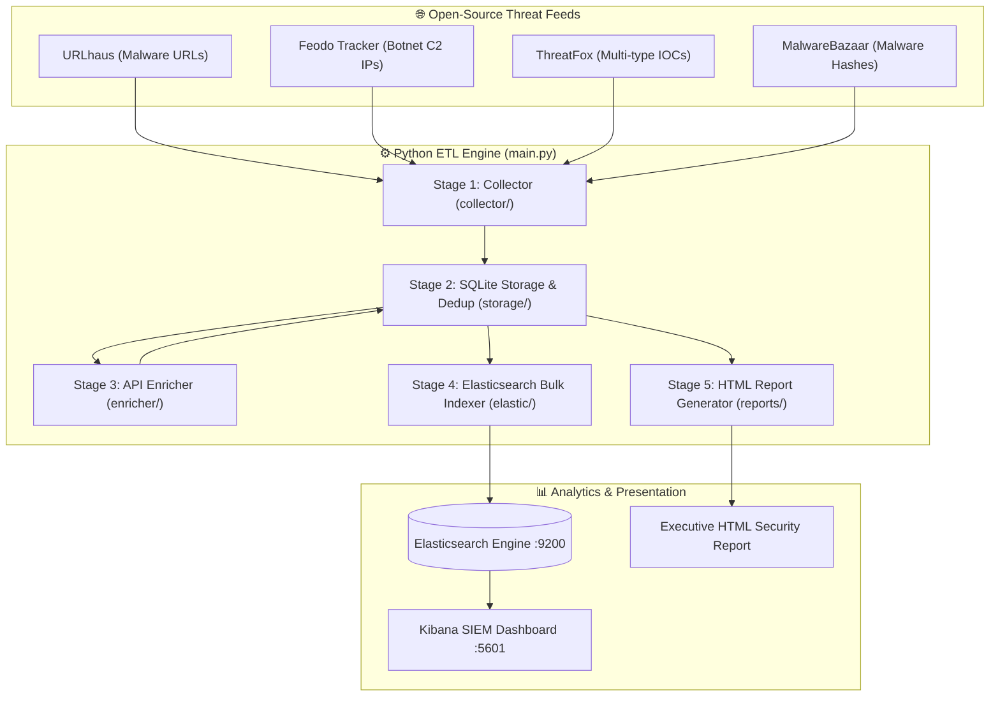
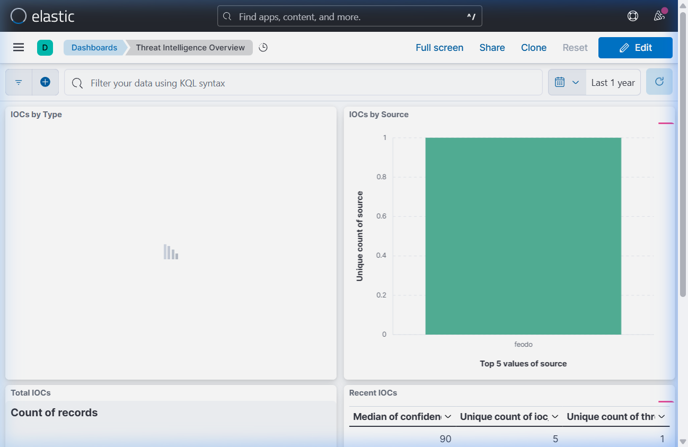
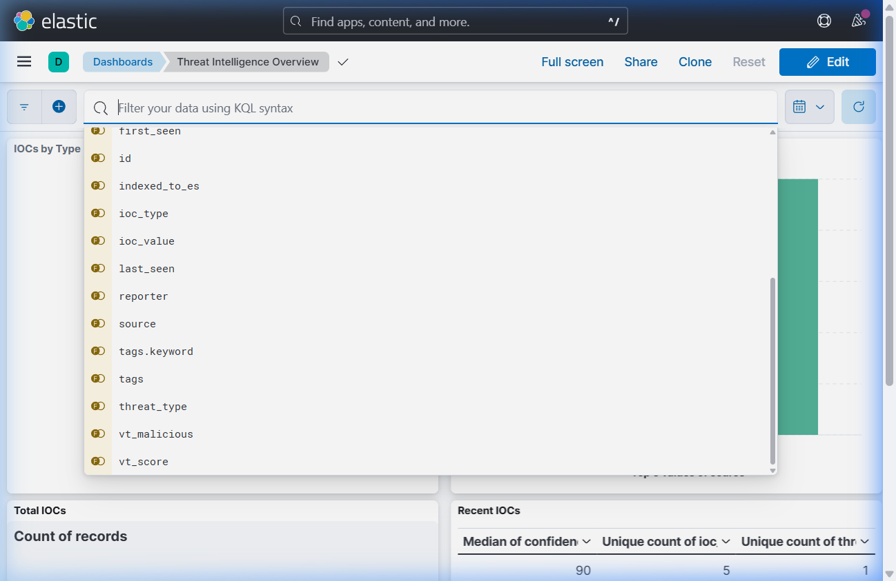
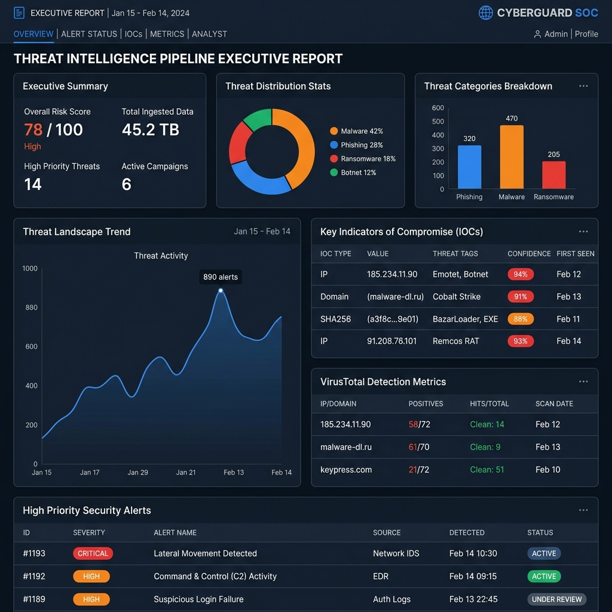

# 🛡️ Threat Intelligence Pipeline — Recruiter Showcase & Project Overview

An enterprise-grade, fully automated cybersecurity ETL (Extract, Transform, Load) pipeline that ingests Indicators of Compromise (IOCs) from open-source threat intelligence feeds, enriches them with OSINT APIs (VirusTotal & AbuseIPDB), stores them in SQLite with strict deduplication, bulk-indexes them into Elasticsearch for real-time threat hunting in Kibana, and automatically generates executive HTML security reports.

---


---

## 📌 Executive Summary & Key Highlights

- **Automated Multi-Feed Aggregation**: Ingests real-time malicious URLs, botnet Command & Control (C2) IPs, malware hashes, and malicious domains from URLhaus, Feodo Tracker, ThreatFox, and MalwareBazaar.
- **Intelligent Enrichment Engine**: Queries VirusTotal and AbuseIPDB APIs for detection ratios, malware family tags, and IP reputation scores.
- **Storage & Deduplication**: Fast local SQLite storage with unique constraints `(ioc_value, source)` preventing redundant processing.
- **Real-Time Search & Analytics**: Automated Elasticsearch mapping and bulk-indexing for instant SIEM / threat hunting queries.
- **Kibana Security Dashboard**: Pre-built visualizations for IOC type distribution, feed source breakdowns, and interactive telemetry tables.
- **Automated HTML Reporting**: Generates standalone, self-contained executive threat summaries for Security Operations Center (SOC) teams.

---

## 📐 Architecture & Data Flow



---

## 📊 Live Kibana Dashboard & Visualizations

The pipeline auto-configures index patterns and default settings in Kibana (`http://localhost:5601`). The dashboard provides real-time visibility into incoming threats:

````carousel

<!-- slide -->

````

> [!TIP]
> **Kibana Configuration Note**: Kibana defaults to `Last 15 minutes` time window. When historical data is indexed, adjusting the time picker to `Last 1 year` or `Today` displays all historical threat metrics immediately.

---

## 📄 Automated HTML Security Report

Every pipeline execution automatically generates a self-contained executive HTML report saved under `reports/output/`. 



> [!NOTE]
> **Report Contents**:
> - **Summary Cards**: Total IOCs collected, new vs duplicate breakdown, enriched counts.
> - **Threat Distribution Charts**: Breakdown by source and IOC type.
> - **Top High-Risk Indicators**: Detailed telemetry table with confidence scores, reporter attribution, and VirusTotal detection metrics.

---

## 💻 CLI Execution Output & Stage Logs

Running `python main.py` triggers all 5 automated stages sequentially:

```text
┌────────────────────────────────────┐
│ 🛡️  Threat Intelligence Pipeline    │
│ Started at 2026-08-13 01:13:14 UTC │
└────────────────────────────────────┘

Stage 1: Collecting IOCs from feeds...
  [INFO] collector.urlhaus: Fetching URLhaus feed...
  [INFO] collector.feodo: Feodo Tracker: fetched 5 C2 IPs
  [INFO] collector.threatfox: Fetching ThreatFox IOCs...
  [INFO] collector.malwarebazaar: Fetching MalwareBazaar hashes...
  ✅ Collected 5 raw IOCs

Stage 2: Storing & deduplicating...
  ✅ 5 new IOCs stored into SQLite (threat_intel.db)

Stage 3: Enriching with threat intelligence APIs...
  [INFO] enricher: Querying VirusTotal & AbuseIPDB...
  ✅ Enriched 5 IOCs

Stage 4: Indexing to Elasticsearch...
  [INFO] elastic_transport.transport: HEAD http://localhost:9200/threat-intel-iocs [status:200]
  ✅ Indexed 5 IOCs → Elasticsearch (index: threat-intel-iocs)
  📊 View dashboard: http://localhost:5601

Stage 5: Generating HTML report...
  ✅ Report saved: reports/output/report_20260813_011324.html

                        Pipeline Summary                         
┌──────────────────┬────────────────────────────────────────────┐
│ Metric           │ Value                                      │
├──────────────────┼────────────────────────────────────────────┤
│ Fetched this run │ 5                                          │
│ New IOCs stored  │ 5                                          │
│ Enriched         │ 5                                          │
│ Indexed to ES    │ 5                                          │
│ Total IOCs in DB │ 5                                          │
│ Report           │ reports/output/report_20260813_011324.html │
└──────────────────┴────────────────────────────────────────────┘
```

---

## 🗄️ Database & Index Schema

### 1. SQLite Table (`iocs`)
| Column | Type | Description |
|---|---|---|
| `id` | INTEGER | Auto-increment primary key |
| `ioc_value` | TEXT | IP, domain, URL, or hash |
| `ioc_type` | TEXT | `ip` \| `domain` \| `url` \| `hash` |
| `source` | TEXT | `feodo` \| `urlhaus` \| `threatfox` \| `malwarebazaar` |
| `threat_type` | TEXT | e.g. `botnet_c2`, `malware`, `phishing` |
| `confidence` | INTEGER | Feed-provided confidence score (0-100) |
| `vt_score` | TEXT | VirusTotal detection ratio (e.g., "15/94") |
| `abuse_score` | INTEGER | AbuseIPDB confidence score (0-100) |
| `indexed_to_es` | INTEGER | Ingestion status flag (0 or 1) |

### 2. Elasticsearch Document Schema (`threat-intel-iocs`)
```json
{
  "_index": "threat-intel-iocs",
  "_id": "feodo_162.243.103.246",
  "_source": {
    "ioc_value": "162.243.103.246",
    "ioc_type": "ip",
    "source": "feodo",
    "threat_type": "botnet_c2",
    "confidence": 90,
    "tags": "Emotet",
    "first_seen": "2022-06-04 21:24:53",
    "last_seen": "2026-03-07",
    "country": "US",
    "reporter": "Feodo Tracker",
    "vt_score": "15/94",
    "vt_malicious": 15,
    "abuse_score": 0,
    "enriched": true,
    "@timestamp": "2026-08-13T01:13:37.008120"
  }
}
```

---

## 🚀 Technical Skills Demonstrated

- **Languages & Frameworks**: Python 3.12, SQL, HTML5/CSS3, Shell/PowerShell
- **Data Engineering & Databases**: SQLite3, Elasticsearch 8.x, Bulk Indexing API, Data Deduplication
- **Cybersecurity & Threat Intelligence**: IOC Tracking (IPs, Hashes, Domains, URLs), OSINT Integrations (VirusTotal, AbuseIPDB, abuse.ch)
- **Containerization & Visualization**: Docker, Docker Compose, Kibana Dashboards, Saved Objects API
